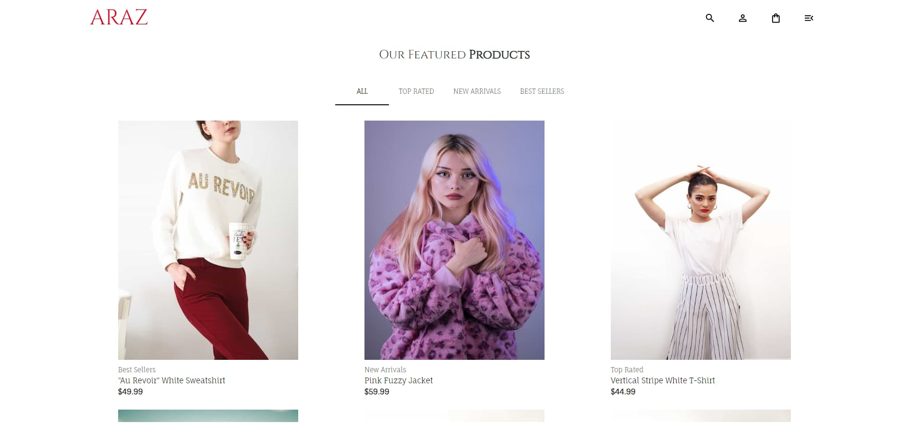

# Ecommerce de Ropa - Proyecto en Desarrollo
This project is a clothing ecommerce under development, built with a frontend in React and TypeScript, and a backend using Strapi. Users can browse products, view details, add items to the shopping cart and perform other typical ecommerce functionality.

## Table of Contents

-  [Usage](#Usage)
-  [Technologies](#technologies)
-  [Contributions](#contributions)
-  [License](#license)

## Usage

Once the application is up and running, users will be able to:

### **Home Page**

  - Photo carousel: Display of featured product images.
  

  - Product list: Products are displayed in a grid with tabs to filter by categories. Each product includes its name, image and price.
  

### **Product Details Page**

  - When clicking on a product, the user is redirected to a page with the product details, which includes:
  - Product details: Name, main image, price and detailed description
  

  - Related products
  

### **Shopping Cart**

  - The cart shows the products added, with their price and quantity. It also includes the total amount to be paid and allows you to remove products from the cart.
  - Although it is not enabled for payments, it allows you to view the selected products.

## Technologies

This project uses the following technologies:

- **Frontend**:
  - **React**: Library for the creation of dynamic and scalable user interfaces.
  - **TypeScript**: JavaScript superset that provides static typing, improving code quality and application scalability.
  - **Material UI**: Library for building modern, responsive and well-styled interfaces.

- **Backend**:
  - **Strapi**: Headless CMS that facilitates the management of content, such as products, categories and other elements of the store.
  - **Node.js**: Platform running the Strapi API, providing a flexible and scalable architecture.

- **Otras herramientas**:
  - **React Router**: Librería para la gestión de la navegación entre las distintas páginas de la aplicación.
  - **Redux Toolkit**: Herramienta que simplifica la gestión del estado global en aplicaciones React. Con Redux Toolkit, es más fácil manejar estados complejos de manera predecible y eficiente.

## Contributions

Contributions are welcome. If you have suggestions or improvements, please create a pull request or open an issue in the repository. Be sure to follow clean code best practices and document your changes.

## License

This project is licensed under the MIT License - see the LICENSE file for details.

